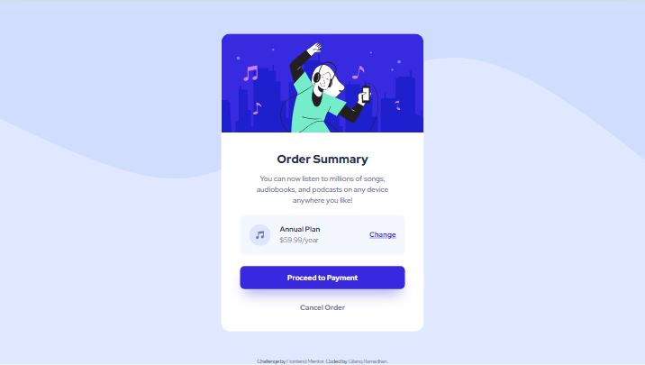

# Frontend Mentor - Order summary card solution

This is a solution to the [Order summary card challenge on Frontend Mentor](https://www.frontendmentor.io/challenges/order-summary-component-QlPmajDUj). Frontend Mentor challenges help you improve your coding skills by building realistic projects.

## Table of contents

- [Overview](#overview)
  - [The challenge](#the-challenge)
  - [Screenshot](#screenshot)
  - [Links](#links)
- [My process](#my-process)
  - [Built with](#built-with)
  - [What I learned](#what-i-learned)
  - [Useful resources](#useful-resources)
- [Author](#author)

## Overview

### The challenge

Users should be able to:

- See hover states for interactive elements

### Screenshot

### Links

- Solution URL: [here](https://www.frontendmentor.io/solutions/order-summary-component-ZvntCb9AmV)
- Live Site URL: [here](https://gilangr1440.github.io/order-summary-component/)

## My process

### Built with

- Semantic HTML5 markup
- CSS custom properties
- Flexbox
- Mobile-first workflow
- SCSS

### What I learned

Build a background wave

### Useful resources

- [getWaves](https://getwaves.io/) - This helped me for making wave easily.

## Author

- LinkedIn - [Gilang Ramadhan](https://www.your-site.com)
- Frontend Mentor - [@gilangr1440](https://www.frontendmentor.io/profile/gilangr1440)
- Instagram - [@gilangr1440](https://www.instagram.com/gilangr1440/)
